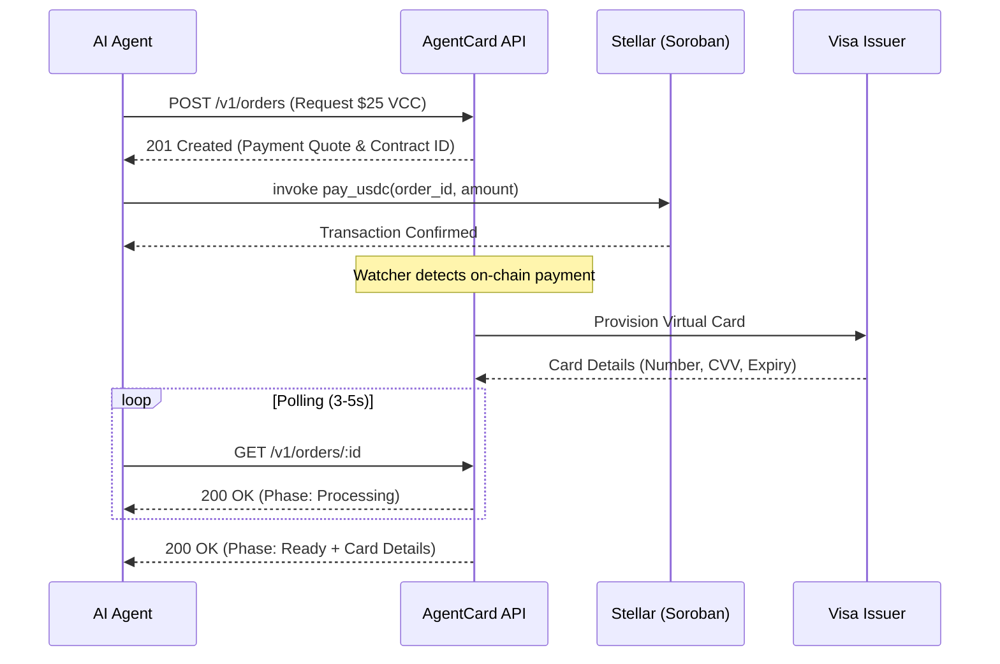

# AgentCard 💳

On-demand virtual Visa card issuance for AI agents. Pay with USDC or XLM on the Stellar network via smart contracts to receive instant, ready-to-use virtual cards for online purchases.

[](https://opensource.org/licenses/MIT)
[](https://stellar.org)
[](https://www.npmjs.com/package/agentcard)

---

## Technical Flow

AgentCard bridges on-chain liquidity with real-world retail by using Soroban smart contracts as a secure escrow and trigger mechanism for card fulfillment.



---

## Repository Structure

```text
AgentCard/
├── backend/        Node.js/Express API, Soroban watcher, SQLite, policy engine
├── contract/       Soroban smart contract (Rust)
├── sdk/            TypeScript client + CLI + MCP server (npm: agentcard)
├── web/            Next.js marketing site, docs, operator dashboard
├── docs/           Published API guide (skill.md, llms.txt)
├── examples/       Integration examples
└── scripts/        Deploy and ops tooling
```

> **Note:** For backward compatibility, the underlying protocol and SDK still use the `agentcard` namespace (referencing the HTTP 402 "Payment Required" status code).

---

## Core Components

### 🖥️ `backend/` — API Server
A high-performance Node.js/Express backend that manages the order lifecycle. It includes a Soroban event watcher, a policy engine for spend limits/approvals, and an operator dashboard API.
- **Database**: SQLite (WAL mode) for lightweight, robust state management.
- **Jobs**: Background workers for reconciliation, expiry, and webhook delivery.

### 📦 `sdk/` — TypeScript SDK + MCP
The primary interface for agents. It provides a clean API for creating orders and handling contract payments.
- **MCP Server**: Pre-configured for Claude Desktop or any MCP-compatible host.
- **CLI**: `npx cards402 purchase` for manual/testing flows.

### 🎨 `web/` — Dashboard & Marketing
A professional Next.js application providing:
- **Operator Dashboard**: Full control over agent spending, order approvals, and treasury margins.
- **Developer Docs**: Comprehensive API reference and quickstart guides.

### 📜 `contract/` — Soroban Smart Contract
A secure Rust contract deployed on Stellar. It receives USDC or XLM and emits a `PaymentEvent` that triggers the fulfillment pipeline.

---

## Quick Start (Agents)

1. **Install the SDK**:
   ```bash
   npm install agentcard
   ```

2. **Purchase a Card**:
   ```typescript
   import { purchaseCardOWS } from 'agentcard';

   const card = await purchaseCardOWS({
     apiKey: process.env.AGENT_CARD_API_KEY!,
     walletName: 'my-agent',
     amountUsdc: '25.00',
     paymentAsset: 'usdc',
   });
   
   console.log(`Card Number: ${card.number}`);
   ```

---

## Documentation

- [**Agent Guide**](./AGENTS.md): Detailed integration steps for AI agents.
- [**Architecture**](./ARCHITECTURE.md): Deep dive into fulfillment pipelines and security models.
- [**Contributing**](./CONTRIBUTING.md): How to build and test the AgentCard ecosystem.

---

## License
MIT © Elite-tch / AgentCard